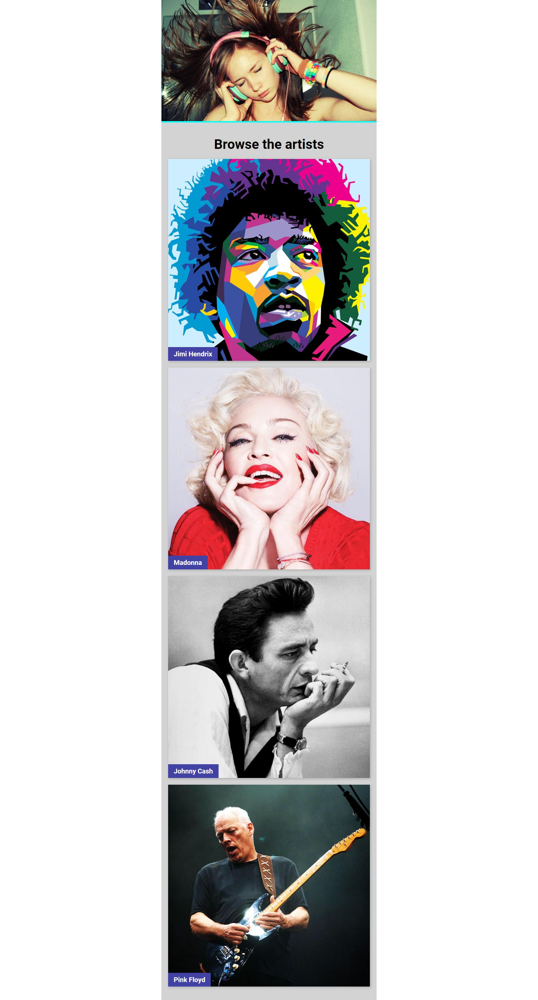

# React Music Application

## About

This Music App is a React-based web application that provides users with a platform to discover and explore artists and their music. The home page features a list of artists and users can click on an artist to view their dedicated page, which includes a more detailed description and a list of albums. This project demonstrates the use of React Routing for building dynamic and interactive web applications and it is part of the weekly challenges from [Brainster](https://brainster.co/ "Brainster") Front-End Academy.

## Features

- Header
- Homepage - Artist list
  - Features a list of artists
- Artist page
  - Detailed artist page with description and a list of albums
- Album page
  - Album details page

## Demo

To see live preview of the project [Click Here](https://jakimoski.github.io/products-filter/ "React Music Application ")

## Screenshot



## Tech Stack

- **[REACT ](https://react.dev/ "React")**
- **[ SASS](https://sass-lang.com/ "SASS")**

## Run Locally

Clone the project

```bash
  git clone https://git.brainster.co/Vlatko.Jakimoski-FE15/brainsterchallenges_vlatkojakimoski_fe15.git
```

Go to the project directory

```bash
  cd my-project
```

Install dependencies

```bash
  npm install
```

Start the app locally

```bash
  npm run dev
```

Build

```bash
  npm run build
```

## Main App

The App has three main pages **Artist List - Home Page**, **Artist Page** and **Album Page**.

## Routs

```javascript
    path: "/",
    element: <RootLayout />,
    children: [
      { index: true, element: <ArtistsList /> },
      { path: "artist/:artistId", element: <ArtistPage /> },
      { path: "artist/:artistId/:albumId", element: <AlbumPage /> },
    ],
```

## Pages

### Artist List - Home Page

Artist List page is the home page of this application. It contains a page title and it is where all artist are listed with **Artist Item** component.

```javascript
<section className="artist-wrapper">
  <h1 className="artist-wrapper__title">Browse the artists</h1>
  {artists.map((artist) => (
    <ArtistItem
      key={artist.id}
      cover={artist.cover}
      name={artist.name}
      id={artist.id}
    />
  ))}
</section>
```

### Artist Page

Artist Page is the dedicated page for every single artist. At the top we have tha artist image, then artist name and bio and lastly all albums that are listed with **AlbumsList** component.

```javascript
<section className="artist-page">
  
  <h1 className="artist-page__title">{currentArtist && currentArtist.name}</h1>
  <p>{currentArtist?.bio}</p>
  <div className="artist-albums-wrapper">
    {currentArtist?.albums.map((el) => (
      <AlbumsList
        key={el.title}
        title={el.title}
        albumId={el.albumId}
        cover={el.cover}
        albumImgUrl={albumImgUrl}
      />
    ))}
  </div>
</section>
```

### Album Page

The album page is a page for every single album of the artists. At the top we have the album image and below the album details like album name, release year and price.

```javascript
<div className="album-wrapper">
  <Link className="back-btn" to=".." relative="path">
    &larr; Back
  </Link>
  
  <div className="album-description">
    <h3>Title: {currentAlbum?.title}</h3>
    <p>Year: {currentAlbum?.year}</p>
    <p>
      Price:{" "}
      {currentAlbum?.price.toLocaleString("en-US", {
        style: "currency",
        currency: "USD",
      })}
    </p>
  </div>
</div>
```

## Components

### NavbarComponent

---

- The NavbarComponent contains one Navlink that leads to the home page.

```javascript
<header className="header">
  <NavLink to={"/"}>
    
  </NavLink>
</header>
```

### Artist Item

- This component is responsible for displaying every artist on the home page. It is a Link that leads to the selected artist dedicated page.

```javascript
<Link to={`artist/${id}`} className="artist-item">
  
  <h2 className="artist-item__name">{name}</h2>
</Link>
```

### Album List

- This component controls displays album lists on the Artist Page.

```javascript
<Link className="artist-albums-item" key={title} to={albumId}>
  
</Link>
```

## Types

---

```javascript
type TArtistItem = {
  id: number,
  cover: string,
  name: string,
};
```

```javascript
type TAlbumList = {
  title: string,
  albumId: string,
  cover: string,
  albumImgUrl(name: string): string,
};
```
